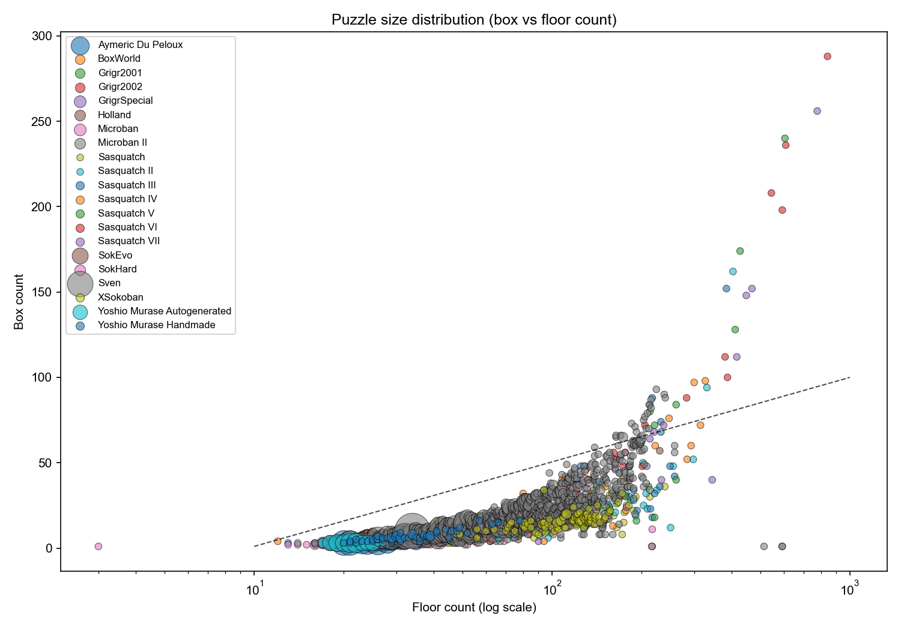
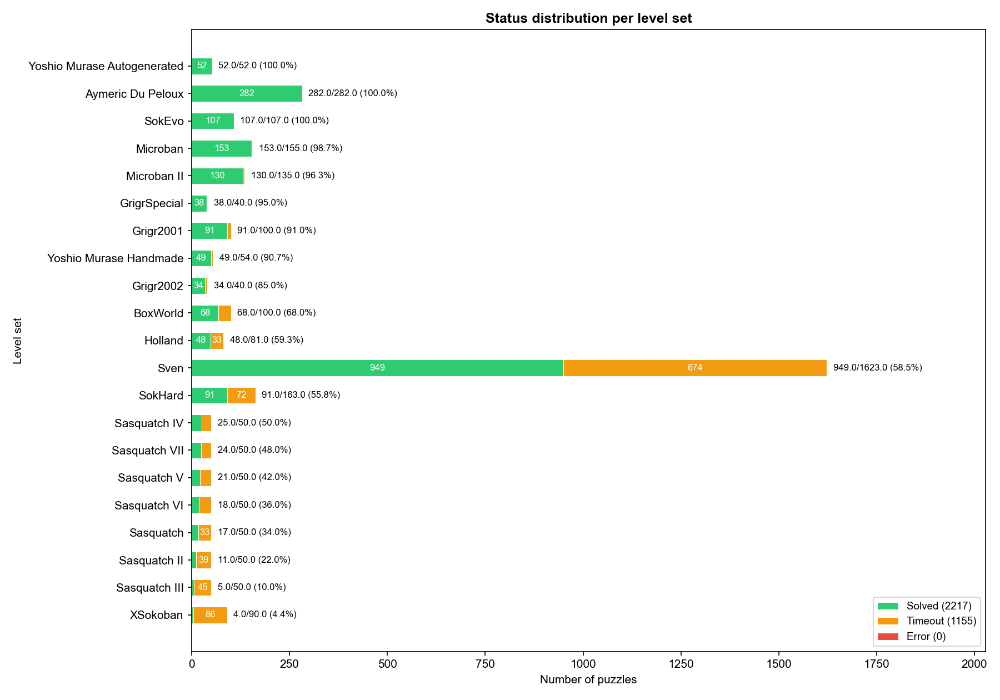
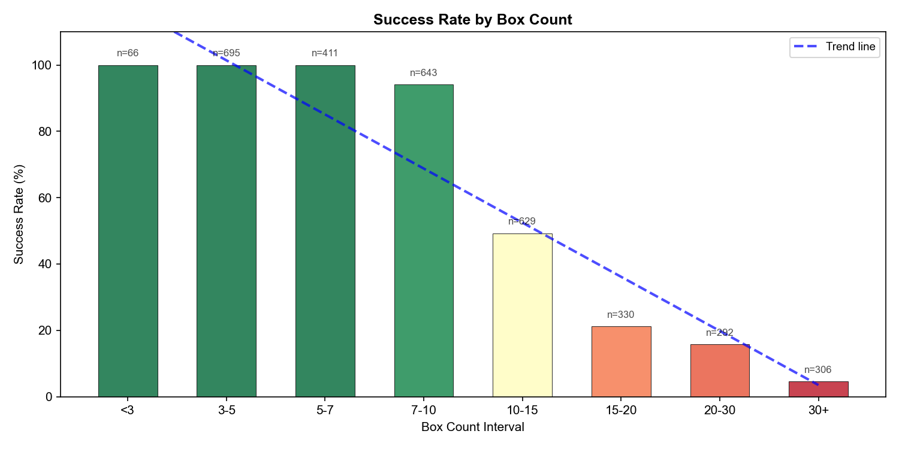
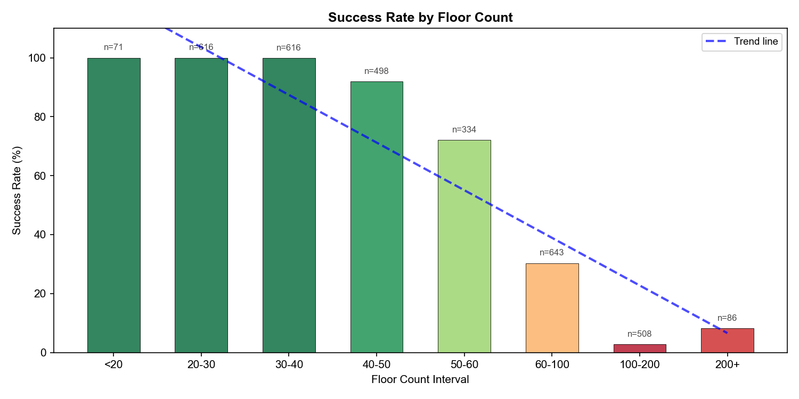
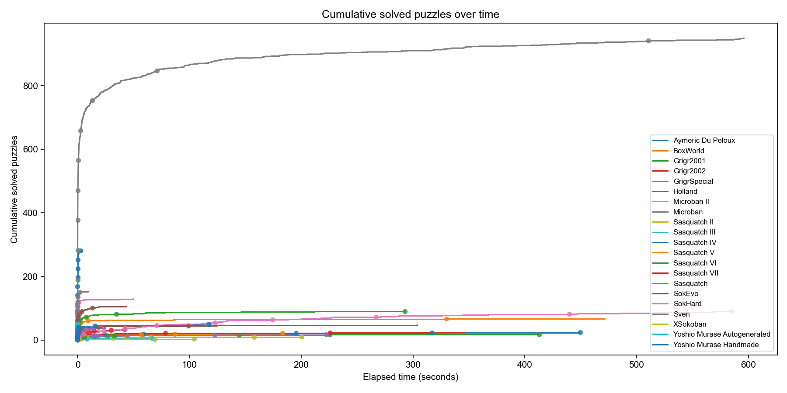
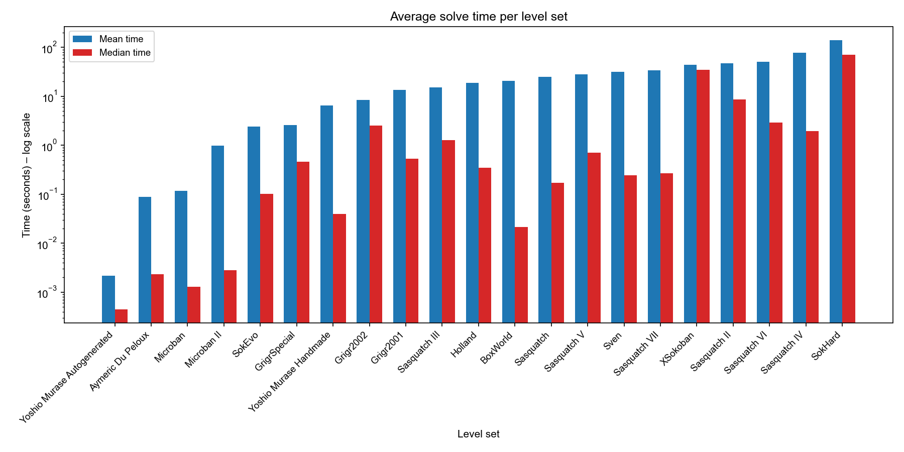

# Benchmark

## Environment

### Hardware & Operating System

- **Date of Execution**: 2026-05-01.
- **CPU**: AMD EPYC 9634.
- **Memory**: 1.5 TB.
- **Operating system**: Rocky Linux 9.5.

### Solver Configuration

- **Time limit per level**: 10 minutes.
- **Strategy**: Greedy Best-First Search (GBFS).
- **Heuristic**: Simple Lower Bound.
- **Deadlock detection**: Static deadlock, freeze deadlock.

## Dataset

The level collections comes from the "Large Test Suite" level set curated by the [Sokoban Solver Statistics](https://sourceforge.net/projects/sokoban-solver-statistics/) project, containing a total of 3272 levels.

The test results for other top solvers can be viewed [here](https://sokoban-solver-statistics.sourceforge.io/statistics/LargeTestSuite/).

## Results

